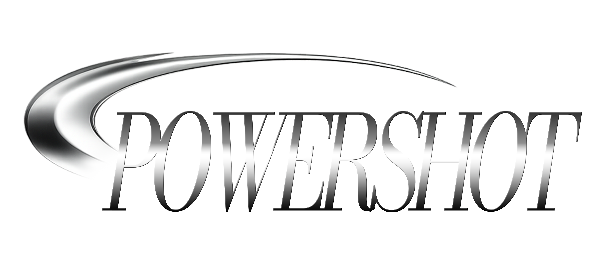

# powershot for three.js

<p align="center">
  
</p>

Authentic digicam, analog tape and film emulation post-processing filters for Three.js.

## Play live here.

https://cl0nazepamm.github.io/powershot-threejs/

## Run

Install dependencies, then start the static dev server:

```sh
npm install
npm run dev
```

Requires WebGPU.

## Use in your Three.js project

Install the package next to your existing Three.js app:

```sh
npm install powershot-threejs three
```

Create one pipeline for your renderer, apply a preset, and render a texture through it:

```js
import * as THREE from "three/webgpu";
import { Pipeline, PRESETS, applyPreset } from "powershot-threejs";

const renderer = new THREE.WebGPURenderer({ canvas });
await renderer.init();

const powershot = new Pipeline(renderer);
powershot.setMode("analog"); // "analog" or "digital"
powershot.setSize(width, height); // internal processing resolution
applyPreset(powershot.ctx, PRESETS.powershot);

// Render `inputTexture` into the current canvas.
powershot.renderTexture(inputTexture, frame);
```

To keep the same on-screen scale while processing at a lower authentic analog resolution, keep your canvas CSS size fixed and pass the lower internal size to `setSize()`.

For motion-picture film emulation, use `FilmPipeline` instead. It models a negative-to-print chain with film stocks, grain, halation, gate weave, flicker, print warmth, and negative inspection.

**Film replaces the tonemap pipeline entirely.** Do not run ACES / AgX / renderer tone mapping (or any other display transform) before it — the negative→print H&D chain *is* the tone map. Feed it your **linear deferred** (scene-linear HDR) render target and call `film.setInputEncoding("linear")` so it skips the sRGB decode. Keep `renderer.toneMapping = THREE.NoToneMapping` on the source pass.

```js
import * as THREE from "three/webgpu";
import { FilmPipeline, FILM_PRESETS, applyFilmPreset } from "powershot-threejs";

const renderer = new THREE.WebGPURenderer({ canvas });
await renderer.init();
renderer.toneMapping = THREE.NoToneMapping;

const film = new FilmPipeline(renderer);
film.setSize(width, height);
film.setInputEncoding("linear"); // scene-linear deferred / HDR RT — not display-referred
applyFilmPreset(film.ctx, FILM_PRESETS.kodak_500t);

// Optional controls.
film.ctx.power.value = 1.0; // blends between source and film render
film.ctx.P.exposure.value = 0.0; // stops at the film plane
film.ctx.P.grainStrength.value = 1.0;
film.ctx.P.halStrength.value = 0.35;
film.ctx.P.negativeView.value = 0; // set to 1 to inspect the negative

film.renderTexture(linearDeferredTexture, frame);
```

For infrared / night-vision rendering, use `InfraredPipeline`. It has a dedicated pseudo-NIR signal path with local gain, broad intensifier halo, pale highlight cores, dark-biased scintillation, tube vignette, and optional eye-mask gating. The built-in preset is tuned around a P45-style white phosphor tube rather than a flat color grade.

```js
import * as THREE from "three/webgpu";
import {
  InfraredPipeline,
  INFRARED_PRESETS,
  applyInfraredPreset,
} from "powershot-threejs";

const renderer = new THREE.WebGPURenderer({ canvas });
await renderer.init();

const infrared = new InfraredPipeline(renderer);
infrared.setSize(width, height);
infrared.setInputMode("rgb"); // "rgb" simulates NIR; "nir" reads a linear mono NIR signal
applyInfraredPreset(infrared.ctx, INFRARED_PRESETS.white_phosphor);

// Optional aligned mask texture for eye/retinal flare regions.
infrared.setEyeMask(maskTexture);

infrared.renderTexture(inputTexture, frame, { dt: deltaSeconds });
```

Useful infrared controls:

- `infrared.ctx.power.value` - blends between source and infrared render.
- `infrared.ctx.P.exposure.value` - input amplification in stops.
- `infrared.ctx.P.localGain.value` - dark-region adaptation strength.
- `infrared.ctx.P.abcAttack.value` / `abcRecover` - temporal auto-brightness time constants (seconds); the whole image dims fast when a bright light enters frame and recovers slower after it leaves. Pass real `dt` into `renderTexture` for correct breathing.
- `infrared.ctx.P.glowStrength.value` - broad intensifier halo amount.
- `infrared.ctx.P.glowSaturate.value` - halo source clip; brighter sources saturate the halo core instead of growing its radius.
- `infrared.ctx.P.eyeStrength.value` - compact highlight / eye flare amount.
- `infrared.ctx.P.noiseAmount.value` - master monochrome sensor and phosphor noise.
- `infrared.setInputMode("nir")` - the source is a linear monochrome NIR or relative-photocathode-response signal in the red channel (e.g. a spectral renderer's NIR output); read raw, no decode, no RGB heuristic. Calibrate with `infrared.ctx.P.fluxScale.value` and start from the `white_phosphor_nir` preset. The input contract is a single-channel LINEAR texture with no tone mapping or sRGB encode. The included preset is visually calibrated, not an absolute electron-count model.
- `infrared.setElectronModel({ electronsPerUnit: 1024 })` - opt into input-referred photoelectron shot noise. `electronsPerUnit` maps relative signal `1.0` to an expected count; the existing `ebi` value supplies the independently sampled dark background. Call `setElectronModel(false)` to restore the original path. It is disabled by default and does not alter Speedball GI.
- `infrared.setInputEncoding("linear")` - the "rgb" source is a linear HDR render target rather than sRGB-encoded (avoids a double decode).
- `infrared.setOutputEncoding("linear")` - emit linear output for a post stack that encodes at its own output stage.
- `infrared.setHaloDisc(true)` - flat disc halo profile instead of a gaussian.

RGB images do not contain actual infrared reflectance. The default path is an artistic pseudo-NIR approximation; pass real monochrome/NIR input and call `setInputMode("nir")` when you have real IR source material.

The pipeline is internally sized for a tube-resolution look (~1280x960); larger canvases automatically scale the scintillation grain so sparkles stay ~one resolution element.

For a normal Three.js scene, render your scene into a `THREE.RenderTarget`, then pass `target.texture` to `renderTexture()`:

```js
sceneRenderer.setRenderTarget(sceneTarget);
sceneRenderer.render(scene, camera);
sceneRenderer.setRenderTarget(null);

powershot.renderTexture(sceneTarget.texture, frame);
```

If your app already uses `THREE.RenderPipeline`, wrap the output node you already had and make any PowerShot effect the final stage:

```js
import * as THREE from "three/webgpu";
import { pass } from "three/tsl";
import {
  FilmPipeline,
  InfraredPipeline,
  Pipeline,
  PRESETS,
  applyPreset,
  effectPass,
  filmPass,
  infraredPass,
  powerShotPass,
} from "powershot-threejs";

const scenePass = pass(scene, camera);

const powershot = new Pipeline(renderer);
powershot.setMode("analog");
powershot.setSize(width, height);
applyPreset(powershot.ctx, PRESETS.powershot);

const renderPipeline = new THREE.RenderPipeline(renderer);
renderPipeline.outputNode = powerShotPass(scenePass, powershot);

function animate() {
  renderPipeline.render();
}
```

All shipped effects can be used the same way:

```js
const film = new FilmPipeline(renderer);
const infrared = new InfraredPipeline(renderer);

renderPipeline.outputNode = filmPass(scenePass, film);
renderPipeline.outputNode = infraredPass(scenePass, infrared);
```

Use `effectPass()` when you want the adapter to create or configure the effect lazily:

```js
renderPipeline.outputNode = effectPass(scenePass, {
  createEffect: (renderer) => new Pipeline(renderer),
  configureEffect: (effect) => {
    effect.setMode("analog");
    applyPreset(effect.ctx, PRESETS.powershot);
  },
  resolutionScale: 0.75,
});
```

`powerShotPass()`, `filmPass()`, `infraredPass()`, and `effectPass()` accept any RenderPipeline-compatible output node, so existing node chains can be passed in place of `scenePass`. The adapter auto-sizes effects with `setSize(width, height)` by default; pass `{ autoSize: false }` if you manage effect resolution yourself.

Useful controls:

- `powershot.ctx.power.value` - blends between source and effect.
- `powershot.setInputEncoding("linear")` - the source is a scene-linear HDR render target: input gain and the camera OETF are applied before the ISP, making it the imager (feed it with the renderer's tone mapping OFF). `FilmPipeline` takes the same flag (skips the sRGB decode; its own `exposure` is already in stops) — and for film, that linear deferred path is the intended setup: Film fully replaces tonemap, so do not tone-map before it.
- `powershot.setInputExposure(stops)` - scene-linear plate gain before the effect. Available on `Pipeline`, `InfraredPipeline`, and `NightshotPipeline`; NightShot forwards it to its sensor. This is separate from each mode's own exposure trim and intentionally absent from `FilmPipeline`, whose stock exposure remains authoritative.
- `powershot.ctx.noiseScale.value` - global noise scale.
- `powershot.ctx.P.jpegStrength.value` - digital JPEG amount.
- `powershot.ctx.P.analogStrength.value` - analog/VHS amount.
- `powershot.ctx.P.analogTrackingChoppiness.value` - tracking-wave character (`0` = legacy smooth wave, `1` = short stepped timing errors).
- `powershot.setOutputColorGrading({ brightness, contrast })` - post-effect corrective grade on linear colour (`powershotLinearGrade`: brightness = photographic gain, ±1 ≈ ±2 stops; contrast = power pivoted on 18% grey). Applied after the ISP / film print / phosphor — not as input exposure. Same API on `FilmPipeline` / `InfraredPipeline` / `NightshotPipeline` (nightshot forwards to its camera ISP).

## Structure

- `index.html` - UI shell and import map for Three.js WebGPU.
- `src/index.js` - public package exports.
- `src/main.js` - demo bootstrap, controls, image loading, and render loop.
- `src/pipeline.js` - reusable realtime ISP stages and WebGPU render passes.
- `src/film.js` - reusable motion-picture film emulation pipeline and stock presets.
- `src/infrared.js` - reusable pseudo-NIR night-vision pipeline and presets.
- `src/render-pipeline.js` - RenderPipeline output-node adapters for PowerShot effects.
- `nv.html` + `src/nv-demo.js` - spectral NIR night-vision demo: the speedball-gi
  spectral tracer (NV mode) renders a linear relative photocathode response that feeds
  `setInputMode("nir")` - no RGB heuristic anywhere. The tube enables the opt-in
  relative-electron model; press `E` to compare it with the original noise path.
- `src/nir_band.js` - realtime three-band raster approximation of the tracer's
  direct term. Material and emitter spectra stay separate until Three performs
  component-wise lighting, then the bands collapse through photocathode weights.
- `src/presets.js` - camera preset values.
- `src/styles.css` - app UI styles.
- `public/logo.png` - PowerSHOT logo.
- `public/vibe coding.jpg` - default test image.

# Acknowledgements

- NTSC
- OpenISP
